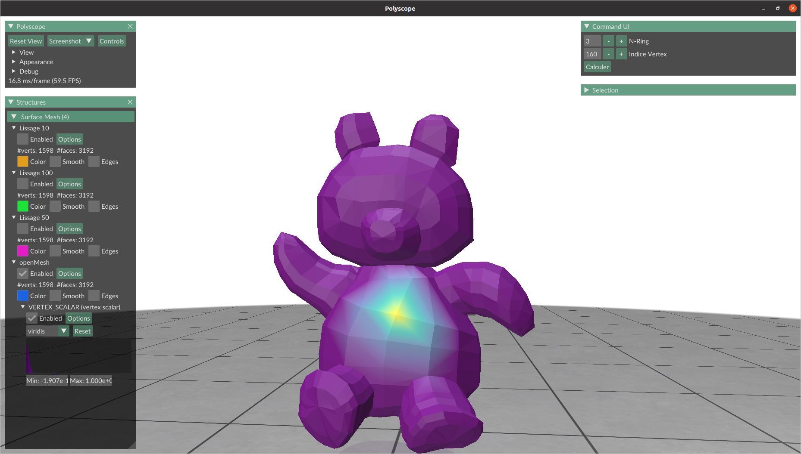
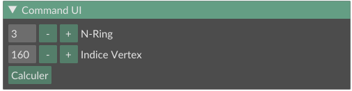
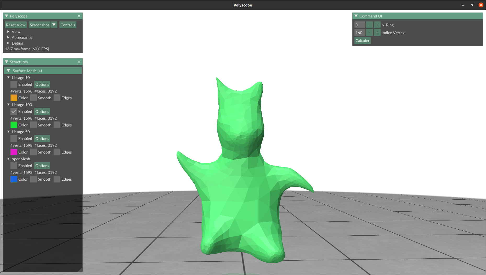

# Projet IGAI Modelisation

Un code implémentant :

- une fonction de lissage laplacienne sur le 1-ring de chaque vertex (Lissage de laplace.cpp)
3 lissages sont présent lors du run : 10 50 et 100 itérations. Il est possible de désactiver les surfaces inutiles pour voir seulement celles qui nous interesse. Possibilité de crée son maillage avec le nombre d'tération voulue ( ligne 170 du main.cpp).
- une fonction permettant de reccupérer le n-ring d'un vertex et d'affecter une valeur aux points de l'anneau (lissage à l'aide de matrice AX = B)
Fonctionne sur le maillage de base. Ici, les bors du n-ring sont mis à zéro, le centre à 1 et les autres points sont evaluer avec eigen.
Pour l'utiliser, rentrer un indice de vertex sur l'UI en haut à droite ainsi qu'un nombre d'anneaux, puis appuyer sur calculer, vous pourrez visionner le résultats à l'aide des VERTEX_SCALAR qui seront apparus en dessous du surface mesh dans l'onglet structure. 

Exemple de lissage 100

OpenMesh 8.1 et Eigen sont inclus dans les dépendances comme sources.
Polyscope est inclus comme submodule.

